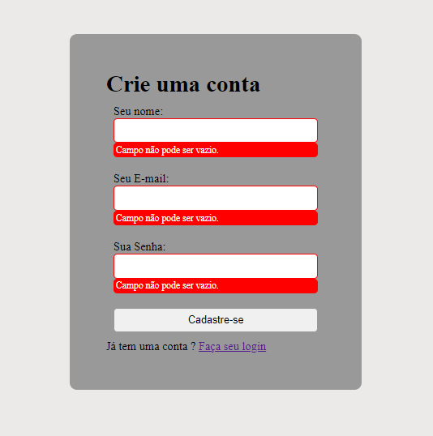

<<<<<<< HEAD
 # Validação de Formulários 
 <h1 align="center">Formulário de Cadastro</h1>
 

    
 

 ## 🚀 Tecnologias

 Esse projeto foi desenvolvido com as seguindes tecnologias:

 - HTML e CSS 
 - JavaScript
 - GitHub
 - Visual Studio Code

 ## 💻 Projeto

 Fiz esse projeto com intuido de expandir minhas habilidades nas tecnologias citadas acima.

 ## :memo: Licença 

 Esse projeto está sobre a licença MIT.
=======

>>>>>>> f38d59b6d89c140adb282c1b27b7aa38ea3b6396
